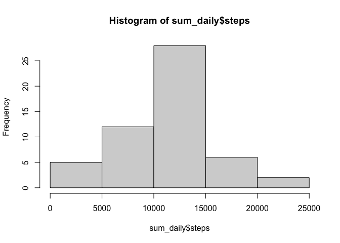
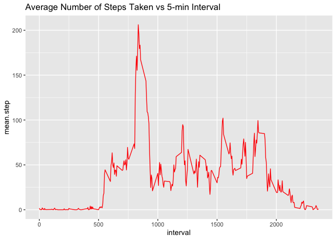
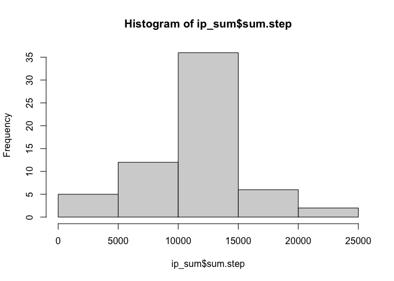
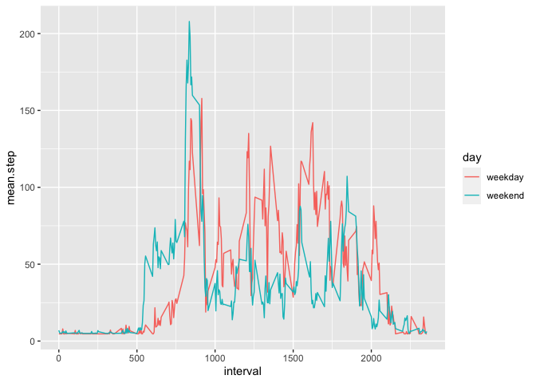

## Loading and preprocessing the data

```r
list.files()#check files in working directoy
```

```
## [1] "activity.csv"                  "activity.zip"                 
## [3] "doc"                           "instructions_fig"             
## [5] "PA1_template.Rmd"              "README.md"                    
## [7] "RepData_PeerAssessment1.Rproj"
```

```r
unzip("activity.zip")#unzip file
list.files()#check unzipped file
```

```
## [1] "activity.csv"                  "activity.zip"                 
## [3] "doc"                           "instructions_fig"             
## [5] "PA1_template.Rmd"              "README.md"                    
## [7] "RepData_PeerAssessment1.Rproj"
```

```r
act <- read.csv("activity.csv")#read unzipped data file
act$date <- as.Date(act$date)#Convert the dates to date format
```


## What is mean total number of steps taken per day?

1.Calculate the total number of steps taken per day


```r
library(dplyr)
```

```
## 
## Attaching package: 'dplyr'
```

```
## The following objects are masked from 'package:stats':
## 
##     filter, lag
```

```
## The following objects are masked from 'package:base':
## 
##     intersect, setdiff, setequal, union
```

```r
#calculate sum of steps by date
sum_daily <- aggregate(steps ~ date, FUN = sum, data = act)
```

2.Make a histogram of the total number of steps taken each day


```r
#explore the sum of step data with histogram
hist(sum_daily$steps)
```

<!-- -->

3.Calculate and report the mean and median of the total number of steps taken per day


```r
mean_daily<- mean(sum_daily$steps)
mean_daily
```

```
## [1] 10766.19
```

```r
median_daily<-median(sum_daily$steps)
median_daily
```

```
## [1] 10765
```

####Answer
Mean is 10766.19
Median is 10765


## What is the average daily activity pattern?

1.Make a time series plot of the 5-minute interval (x-axis) and the average number of steps taken, averaged across all days (y-axis)


```r
library(ggplot2)
act%>% 
  group_by(interval) %>%
  summarize(mean.step=mean(steps,na.rm=T)) %>% #group by interval, calculate the mean for each group (removed NA)
  ggplot(aes(x=interval,y=mean.step)) + 
  geom_line(color="red")+
  labs(title="Average Number of Steps Taken vs 5-min Interval")
```

<!-- -->


2.Which 5-minute interval, on average across all the days in the dataset, contains the maximum number of steps?


```r
#assign a name to the mean.step by interval table
mn_stp_intv<-act%>% 
  group_by(interval) %>%
  summarize(mean.step=mean(steps,na.rm=T)) 
#figure out the max mean.step
max_step<-which.max(mn_stp_intv$mean.step)
#select the row that has max_step, and then select the interval in that row
mn_stp_intv[max_step,]$interval
```

```
## [1] 835
```

####Answer:
The 835 row contains max number of steps


## Imputing missing values
1.Calculate and report the total number of missing values in the dataset


```r
sum(is.na(act))
```

```
## [1] 2304
```

2.Filling missing values with mean.


```r
#calculate the mean that will be assigned to na values
mean_4na<-mean(act$steps,na.rm=T)
```

3.Create a new dataset that is equal to the original dataset but with the missing data filled in.


```r
#initialize a new dataset with the original dataset
imputed <- act
#loop over each item in the list of steps column
for (i in 1:length(imputed$steps)) {
    if (is.na(imputed$steps[i])) {#if the step at i location is na
        imputed$steps[i] <- mean_4na #then assign that value mean_4na
    }
}
```

4.Make a histogram of the total number of steps taken each day. Calculate and report the mean and median total number of steps taken per day. Do these values differ from the estimates from the first part of the assignment? What is the impact of imputing missing data on the estimates of the total daily number of steps?


```r
#create a table that has sum of step for each date
ip_sum<-imputed%>%group_by(date)%>%summarise(sum.step=sum(steps))
#plot the sum of steps each day
hist(ip_sum$sum.step)
```

<!-- -->

```r
#mean of sum.steps
mean(ip_sum$sum.step)
```

```
## [1] 10766.19
```

```r
#median of sum.steps
median(ip_sum$sum.step)
```

```
## [1] 10766.19
```

#### Answer: 
The value of both mean and median are 10766.19, which is different from previous unimputed dataset.
Assigning mean to na values influene the results of median, since more values become the mean


## Are there differences in activity patterns between weekdays and weekends?

1.Create a new factor variable in the dataset with two levels – “weekday” and “weekend” indicating whether a given date is a weekday or weekend day.


```r
#create a new column called "day" in the impute dataset
imputed$day <- ifelse(
  weekdays(imputed$date) %in% c("Saturday","Sunday"), #whether the date is sat or sunday
  "weekday", #if condition is yes, then assign value "weekday"
  "weekend"  #if condition is no, then assign value "weekend"
  )
```

2.Plot 5-minute interval (x-axis) and the average number of steps taken, averaged across all weekday days or weekend days (y-axis). 


```r
#calculate mean of step for each interval and day (week vs weekend)
imputed %>% group_by(interval,day) %>% summarise(mean.step=mean(steps))%>%
  ggplot(aes(x=interval, y=mean.step, color=day)) + 
  geom_line() 
```

```
## `summarise()` has grouped output by 'interval'. You can override using the
## `.groups` argument.
```

<!-- -->

